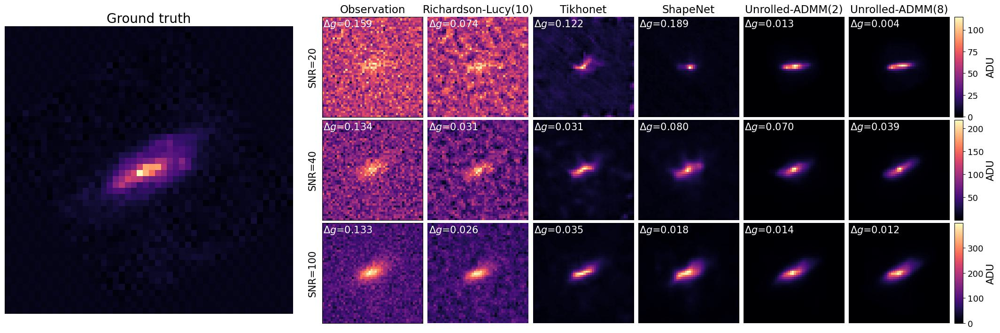

# Galaxy Image Deconvolution for Weak Gravitational Lensing with Unrolled Plug-and-Play ADMM

<b>[Tianao Li](https://lukeli0425.github.io)</b><sup>1</sup>, <b>[Emma Alexander](https://www.alexander.vision/emma)</b><sup>2</sup><br>
<sup>1</sup>Tsinghua University, <sup>2</sup>Northwestern University<br>
_Monthly Notices of the Royal Astronomical Society, 2023_

Official code for [_Galaxy Image Deconvolution for Weak Gravitational Lensing with Unrolled Plug-and-Play ADMM_](https://arxiv.org/abs/2211.01567).




---

## Running the Project

To clone this project, run:

```zsh
git clone https://github.com/Lukeli0425/Galaxy-Deconv.git
```

Create a virtual environment and download the required packages:

```zsh
pip install -r requirements.txt
```

If you want to train the models with [Shape Constraint](https://doi.org/10.1051/0004-6361/202142626), please install [AlphaTransform](https://github.com/dedale-fet/alpha-transform).

Download our simulated [galaxy dataset](https://drive.google.com/drive/folders/1IwgvbetMDpLK2skRalYWmth2J1gvF-qm) from Google Drive.

To train the models, run [`train.py`](train.py) and choose parameters and loss function for your training, for instance:

```zsh
python train.py --model Unrolled_ADMM --n_iters 8 --n_epochs 50 --loss Multiscale --lr 1e-4
```

Test the algorithms from the perspectives of time and performance with [`test.py`](test.py). Uncomment the methods to be tested in the code and specify the number of galaxies you want to use in the test dataset:

```zsh
python test.py --n_gal 10000
```

Similarly, you can test the robustness of the algorithms to systematic errors in PSF with [`test_psf.py`](test_psf.py):

```zsh
python test_psf.py --n_gal 10000
```

All the test results will be automatically saved in the [`results`](results) folder.

---

## Using the model on your own data

We saved our models trained on our LSST dataset (see [`saved_models`](saved_models)). We also provide a tutorial for using the suggested model on your data, see [`tutorial/deconv.ipynb`](tutorial/deconv.ipynb) for details. 

---

## Simulating your own dataset and Retraining

We simulated our dataset with the modular galaxy image simulation toolkit [Galsim](https://github.com/GalSim-developers/GalSim) and the [COSMOS Real Galaxy Dataset](https://zenodo.org/record/3242143#.Ytjzki-KFAY). To us our image simulation pipeline, one need to first download the COSMOS data [here](https://zenodo.org/record/3242143#.Ytjzki-KFAY) or download with Galsim:

```zsh
galsim_download_cosmos [-h] [-v {0,1,2,3}] [-f] [-q] [-u] [--save] [-d DIR] [-s {23.5,25.2}] [--nolink]
```

<!-- Create a `data` folder and download COSMOS dataset:

```zsh
mkdir data
cd data
wget https://zenodo.org/record/3242143/files/COSMOS_23.5_training_sample.tar.gz
wget https://zenodo.org/record/3242143/files/COSMOS_25.2_training_sample.tar.gz
```

Unzip the downloaded files:

```zsh
tar zxvf COSMOS_23.5_training_sample.tar.gz
tar zxvf COSMOS_25.2_training_sample.tar.gz
``` -->

Run [`generate_data.py`](generate_data.py) to simulate your own dataset under different settings (remember to change the path to your COSMOS data). Simulate your dataset for deconvolution task by running

```zsh
python generate_data.py --task Deconv --n_train 40000
```

We provide the dataset generation code for denoising task. The denoising dataset is used in our ablation studies (see [`figures/ablation.ipynb`](figures/ablation.ipynb)) to train the plugin denoiser in [ADMMNet](https://doi.org/10.1051/0004-6361/201937039). Simulate your dataset for denoising task by running

```zsh
python generate_data.py --task Denoise --n_train 40000
```

We provide a detailed tutorial for image simulation (see [`tutorials/image_simulation.ipynb`](tutorials/image_simulation.ipynb)), where you can find out how to set up your simulations.

You can train the models on your dataset.

---

## Recreating our figures

The [`figures`](figures) folder holds the figures in this paper and the files that created them (see [`figures/README.md`](figures/README.md)). To recreate the figures with your own results, you can use the given files and follow the instructions we provide.

---

## Citation

```bibtex
@article{li2022galaxy,
  title={Galaxy Image Deconvolution for Weak Gravitational Lensing with Unrolled Plug-and-Play ADMM},
  author={Li, Tianao and Alexander, Emma},
  journal={arXiv preprint arXiv:2211.01567},
  year={2022}
}
```
